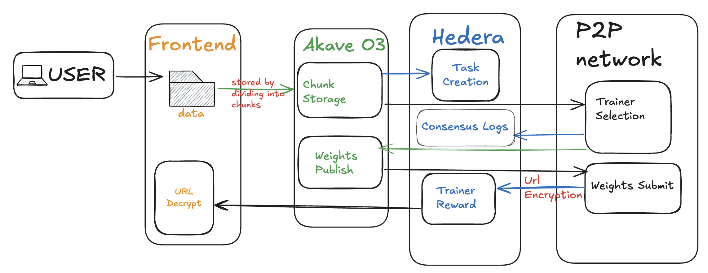

# P2P Federated Learning

A new way to train machine learning models without owning your own compute resources.

Our platform connects ML users, who want affordable model training, with trainers who have spare computing power lying idle (think gaming laptops or workstations with beefy GPUs).

By combining Hedera blockchain, Akave O3 decentralized storage, and py-libp2p networking, we make sure the whole process runs in a way that’s transparent, trustless, and cost-efficient.

## Demo Video Link

https://www.loom.com/share/49afb7fc3a29451482d053b8bf19aa62

# Getting Started

Here’s how you can set things up locally and play with the platform.

## Prerequisites  

- **Frontend stack**: Node.js, React.js, yarn  
- **Akave O3 keys**: `AWS_ACCESS_KEY_ID`, `AWS_SECRET_ACCESS_KEY`  
  - Get your Akave creds here: [Akave O3 Docs](https://docs.akave.xyz/akave-o3/introduction/akave-environment/)  
- **Hedera keys**: `OPERATOR_ID`, `OPERATOR_KEY`  

## Installation

### Frontend Setup

```bash
git clone https://github.com/lla-dane/P2P-Federated-Learning.git
cd your-repository/frontend
yarn
```

Then create a `.env` file and add:
```env
AWS_ACCESS_KEY_ID=
AWS_SECRET_ACCESS_KEY=
API_KEY=
API_SECRET=
JWT_TOKEN=
``` 

### P2P Network
Fire up a bootstrap node, client, or trainer:
```bash
cd P2P-Federated-Learning
python -m venv .venv 
uv sync --all-extras
cd p2p
python runner.py
```

## Usage

### Target Users

**1. ML Users**
- They have got the data + model but not the compute.
- Onboard with nothing more than a Hedera wallet (HashPack works great)
- Upload your dataset and model → get back trained weights ready to plug in.

**2. Trainers (Gamers / Compute Providers)**

- They have got idle GPUs or CPUs just sitting around.
- Turn that spare compute into income by training ML jobs.
- Trainers compete, so pricing stays fair and efficient.

### Interfaces
- **Frontend GUI** -> user-friendly training and dataset upload
- **Public API** -> if you prefer command-line workflows or want to host your own orchestration node.

## Implementation Details ⚙️

### High-Level Flow

- ML user uploads dataset + model.
- Dataset is split into chunks and stored on Akave O3.
- Each chunk gets a presigned URL, which is shared with the P2P network (no need to move heavy files around directly).
- Trainer nodes fetch chunks, train locally, and upload results back to Akave O3.
- Hedera smart contracts handle escrow, payments, and record progress transparently.
- Final trained weights are returned as encrypted presigned URLs, accessible only to the ML user.

- ### Architecture
  
  
### Akave O3

**We rely on two core features of Akave O3: its command-line interface and presigned URLs.**
Here’s the flow: when an ML user uploads a dataset, the frontend automatically splits it into smaller chunks and stores them on Akave O3. Instead of broadcasting those large files directly across the P2P network, we generate presigned URLs for each chunk.

Why does this matter? Because presigned URLs give us a lightweight, secure pointer to the data. That means:
No massive payloads clogging up the P2P layer — we’re only passing URLs, not entire files.
No credential sharing — trainers get temporary access tokens, not your permanent keys.

Scalability built-in — distributing URLs is trivial, even if the dataset is huge or hundreds of trainers are competing.

Trainers simply fetch the chunks they need via these URLs, perform training locally, and then push the resulting weights back to Akave O3. They also generate presigned URLs for the new weights, which are then encrypted and published on-chain.
This way, the heavy lifting of dataset and weight transfers happens over Akave O3’s storage layer, while our P2P + blockchain stack only needs to handle small, verifiable, trust-minimized references.


### Hedera Blockchain

We use two key features of the Hedera blockchain: Smart Contracts and the Consensus Service.

- **Smart Contracts**:
When a user submits their dataset and model through the frontend, a smart contract call marks the start of a new training round. Once training is complete, trainers upload the final weights to Akave O3 and publish an encrypted presigned URL on-chain. The frontend listens to contract events and, once it detects completion, fetches that encrypted URL, decrypts it, and delivers the final weights back to the ML user. This makes the entire process trustless and auditable.

- **Consensus Service**:
Training jobs don’t always go smoothly — a trainer’s GPU might overheat, memory might run out, or a node could just crash. To avoid losing visibility when this happens, trainer nodes stream their state logs to a Hedera Consensus Topic in real time. That way, even if a node goes offline, its activity trail is permanently preserved on-chain for debugging and accountability.

Together, these features ensure not just decentralized payments and job orchestration, but also transparent auditing and fault tolerance baked into the platform itself.

### P2P Network:
We use py-libp2p to make the whole peer-to-peer part of the system actually work — bootstrapping, discovery, pubsub, and RPCs. Here’s how it plays out:

- **Bootstrap Node**: We start with a fixed bootstrap address. The frontend queries this node to get a “mesh summary” — basically a snapshot of which client nodes are currently online.

- **Client node as representative**: Instead of throwing the frontend directly into the swarm, we let it pick a client node from the mesh to act as its delegate inside the P2P network. This client is the bridge between the user and the rest of the swarm.

- **Training round topic**: Once the user decides to train, the client creates a brand-new pubsub topic dedicated to that training round. Trainer nodes discover and join this topic through libp2p’s peer discovery mechanisms.

- **Distributing data**: The frontend triggers an RPC call to the client, handing over presigned URLs for dataset chunks and the model script. The client then broadcasts those URLs into the training round mesh, so trainers can fetch only the chunks they’re assigned.

- **Trainers do the heavy lifting**:Each trainer node:

  - Pulls its dataset chunk via the presigned URL.
  - Trains locally on that data.
  - Uploads the resulting weights back to Akave O3.
  - Generates a presigned URL for those weights.
  - Encrypts the URL with the ML user’s public key.
  - Publishes the encrypted URL on Hedera.

## API's

```bash
curl -X POST http://localhost:9000/command \
    -H "Content-Type: application/json" \
    -d '{"cmd":"publish","args":["fed-learn","hello"]}'

curl -X POST http://localhost:9000/command \
    -H "Content-Type: application/json" \
    -d '{"cmd":"bootmesh"}'

curl -X POST http://localhost:9000/command \
    -H "Content-Type: application/json" \
    -d '{"cmd":"mesh"}'

curl http://localhost:9000/status
```

## Deployed Hedera Contract Address

#### ContractId: 0.0.6917091
#### TopicId (Hereda Consensus Service): 0.0.6914391
